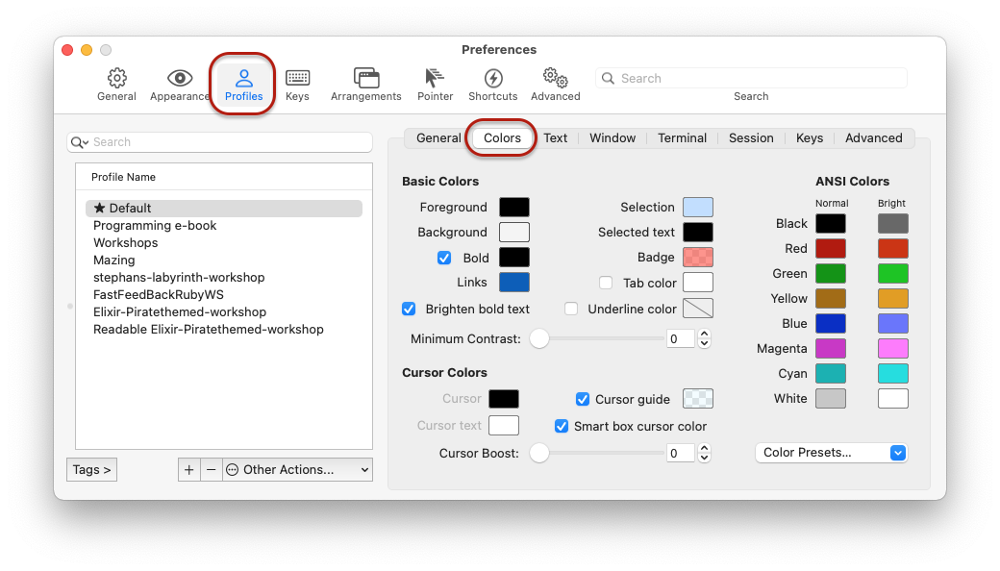
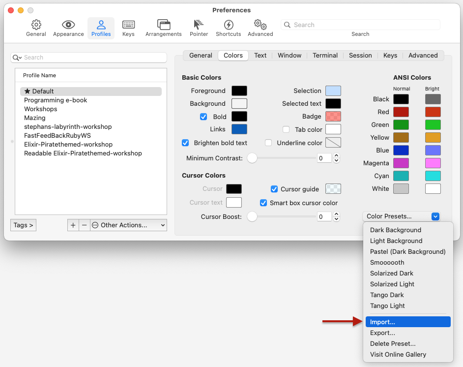

# Seaside's -iTerm2 Colours

The configuration of colours I use for [iTerm2](https://iterm2.com).

* Uses a light (but not white) background
* Changes the default colours slightly in order to make text readable for all colours.

## How to use

* Clone this repository
* Get [iTerm2](https://iterm2.com), if you haven't already
* Open iTerm2
* Open the preferences window and go to "Profiles" and select the profile you want to set the colours for
  
* Select the 'Colors' tab
* Use 'Color Presets…' -> 'Import'
  
* Select the file `seasidetestings.itermcolors` in the repository you just cloned.

